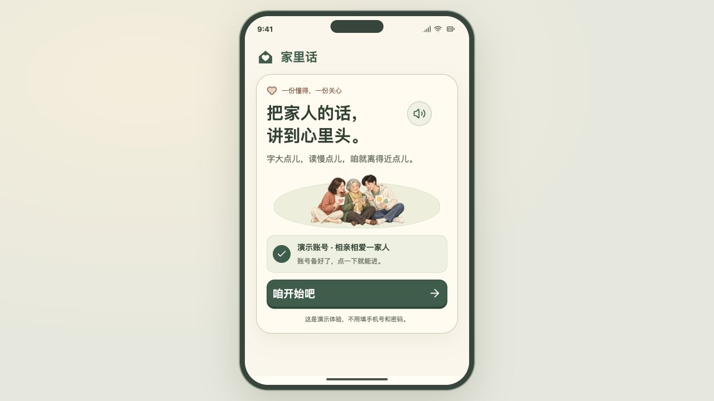

# 家里话

把家人的微信、朋友圈和短信，变成老人看得清、听得懂的大字解释。

**[打开 Demo](https://violetloveAI.github.io/jialihua-demo/)** · [部署说明](docs/github-pages.md)



## 怎么体验

点击开始，选择“我是老人”或“我是子女”，再选择语言和是否第一次使用。

- 老人端从演示相册选一张截图，查看解释、听普通话或河南话、放大原图，再保存到历史记录。字体有四档，朗读可以放慢。
- 子女端导入演示文案或截图，选择导出语言，保存大字长图或打开配有朗读的视频。

右上角可切换演示身份。刷新会重新进入登录和身份选择；保存的记录保留在当前浏览器中。

## 演示范围

这是 BAYTECH 黑客松的演示版本，包含 9 张虚构消息截图、3 个写话示例及对应的 24 条双语视频。案例、插画和朗读已提前准备。GitHub Pages 版本不调用在线模型，不消耗 API 额度，也不支持真实账号登录或跨设备同步。

子女端修改文字后仍可导出长图；新文案的视频合成和任意截图识别需要本地 Node 服务及相应配置。公开网页只播放与原始演示内容匹配的视频；修改文字后，没有匹配预制录音的内容也无法朗读。

## 本地运行

需要 Node.js 24 和 npm。播放已准备的媒体不需要密钥。

```sh
npm ci
npm run build:pages
npm run preview:pages
```

打开 <http://127.0.0.1:4176/jialihua-demo/>。

在另一个终端运行测试并检查发布素材：

```sh
npm test
npm run check:pages
```

本地后端版本可用 `npm run build` 后执行 `npm start`，地址为 <http://127.0.0.1:4174/>。模型配置参见 `.env.example`，密钥只保存在本地 `.env.local`。

## 项目结构

- `src/`：React 界面、演示数据、朗读与浏览器内导出。
- `public/`：演示截图、插画、音频时间轴和预制视频。
- `server/`：本地模型及媒体接口，不部署到 GitHub Pages。
- `tests/`：功能、交互及静态部署测试。
- `scripts/`：素材准备、发布检查和打包。
- `.github/workflows/pages.yml`：手动检查与发布流程。

界面使用 React、Vite 和 Lucide。历史记录使用 IndexedDB，长图在浏览器 Canvas 中生成；河南话音频由阿里云 CosyVoice 生成。网页需要网络加载媒体，密钥不随网页发布。

演示截图用于展示沟通场景，不代表真实聊天记录；项目与微信、运营商及截图中模拟的平台无隶属关系。第三方依赖遵循各自许可。本项目尚未另行授予代码与原创素材的复用许可。
